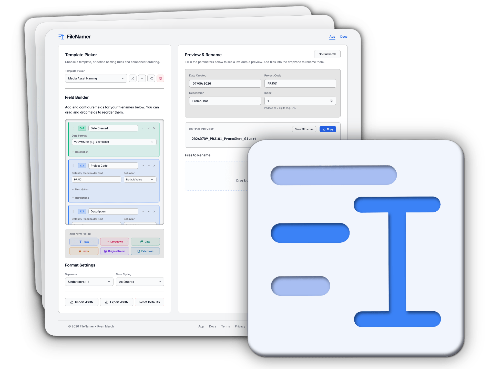
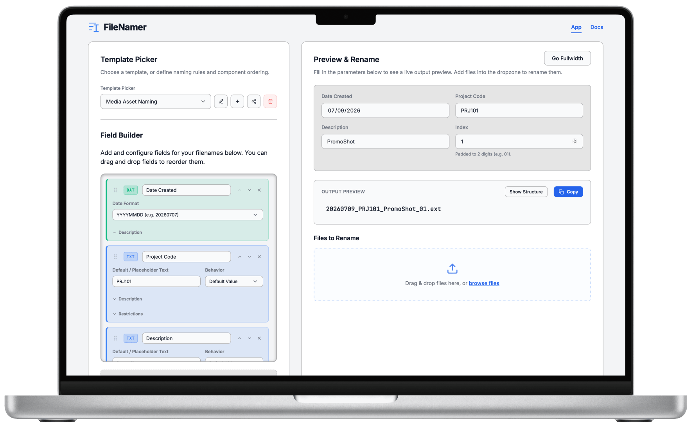
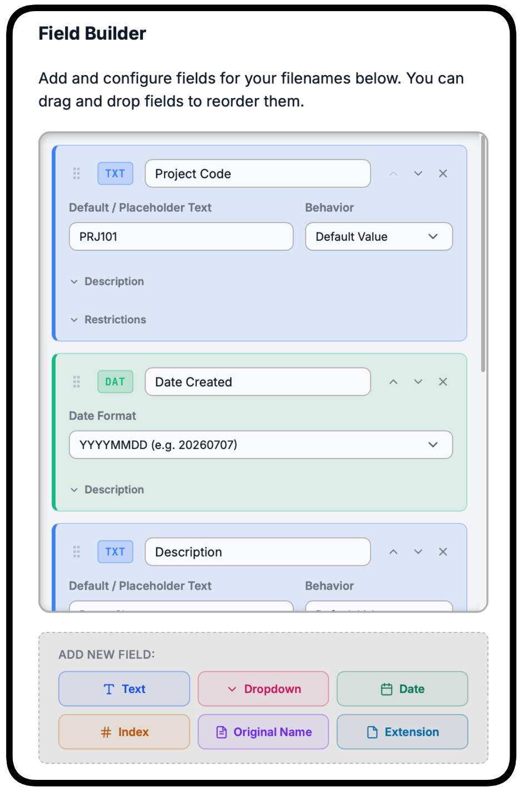
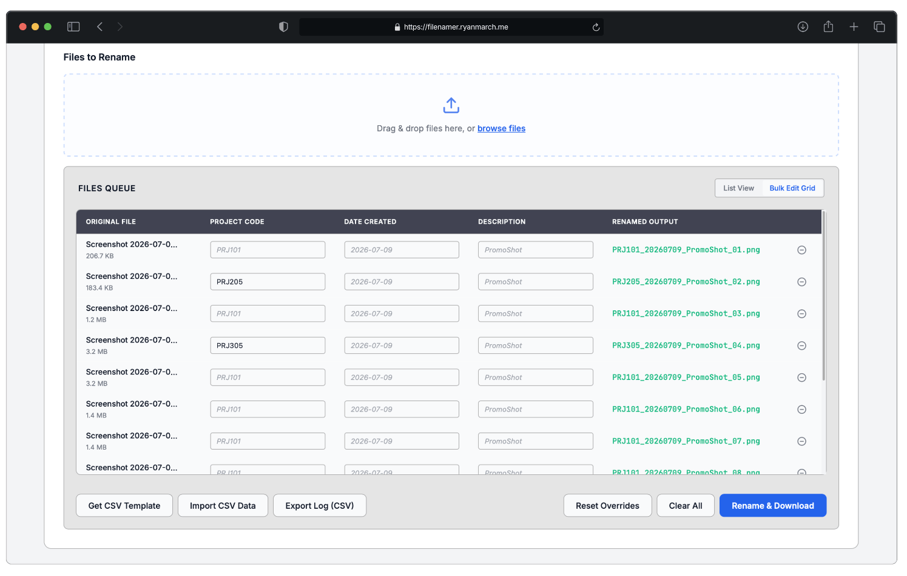
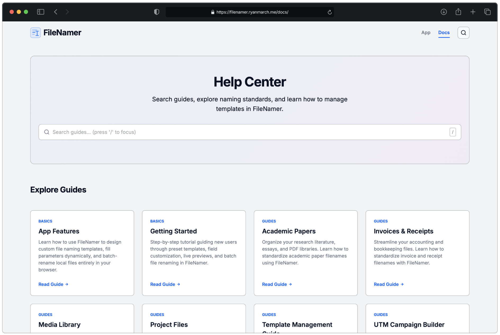

<div align="center">

<div style="max-width: 80%">

[][demo]

</div>

# FileNamer
<span style="font-size: 20px; font-weight: 600;">A local-first application for defining naming conventions and batch renaming files.</span>

<div style="max-width: 65%">

[][demo]

</div>

</div>


# FileNamer

FileNamer is a lightweight, local-first web utility for designing standardized naming templates and batch renaming files directly in the browser. 

It is designed for professionals and teams (e.g., content managers, researchers, accountants) who need to maintain strict, structured guidelines for document and media file naming.

## Key Features

- **Full Customizability**: Define parameters, dates, select lists, and sequence indexing to enforce naming formats.
- **Pre-Built Templates**: Common-use naming templates including:
    - Project Files
    - Academic Papers
    - Invoices & Receipts
    - UTM Campaign Builder
    - Media Library
- **Client-Side Rename & Packaging**: Drag and drop or browse files to queue them. Files are processed entirely locally in the browser and downloaded directly (or packaged into a `.zip`). **Your files never leave your computer.**
- **Bulk Edit Spreadsheet Grid**: Switch from the simple list view to a spreadsheet-like grid to customize/override naming parameters for individual files in the queue.
- **CSV Data Integration**: Export templates to a CSV file, populate them in your spreadsheet software (e.g. Excel, Sheets), and import them back to automatically fill segment values.
- **URL-Based Template Sharing**: Serialize template rules into the URL hash so you can bookmark or share naming schemas with teammates without an account or server backend.
- **PWA / Offline Support**: Service worker caching enables full offline functionality as a Progressive Web App.

<div align="center">

[][demo]
*Get started quickly with pre-built templates or create your own.*

</div>


## How to Use FileNamer

### 1. Choose or Build a Template
Use the **Template Picker** sidebar to choose a preset or click the **Plus (+)** button to create a custom template.
- Add fields: **Text**, **Dropdown**, **Date**, **Index** (automatic padding), or **Extension**.
- Customize configurations like characters length restrictions, whitespace blocking, date formats (including custom templates), and case styling (e.g. `lowercase`, `snake_case`, `camelCase`).
- Use the grab handle icon or the up/down arrows to reorder segments.

<div align="center">

[][demo]
*Create and edit custom fields using the intuitive field builder.*

</div>

### 2. Enter Parameters & Preview
As you add fields, form inputs appear dynamically in the main viewport. Filling out these fields and see real-time updates to the **Output Preview**. Click **Show Structure** to see which visual segment maps to which template variable.

### 3. Load & Process Files
- Drag files into the dropzone or click **Browse Files**.
- **List View**: Displays original files side-by-side with their target renamed output.
- **Bulk Edit Grid**: Displays an interactive table where you can override individual parameters per file (e.g. setting a unique sequence or project code for row 3).
- Click **Rename & Download** to start the renaming process and download the files.

<div align="center">

[][demo]
*Edit files in a spreadsheet grid after applying bulk formatting.*

</div>


### 4. Import/Export Templates
- Export a template to a `.json` configuration file, or share it using the **Share Link** button to copy a link with the template configuration encoded directly into the URL.

## User Guide Help Center

For more information about using FileNamer, visit the [User Guide](help). You'll find helps guides for getting started, app feature overviews, and detailed documentation for each template type.

<div align="center">

[][help]

</div>

<!-- ## Project Architecture

The application is built using vanilla Web APIs (HTML5/CSS3/ES6 Modules) to maximize performance, keep dependencies low, and ensure longevity.


```

├── app/
│   └── index.html      # Main Single Page App viewport
├── css/
│   └── style.css       # Unified design token system and stylesheets
├── docs/
│   ├── index.html      # Documentation homepage
│   ├── header.js       # Shared documentation theme and navigation script
│   └── [modules]/      # Feature-specific guides (UTM builder, media library, etc.)
├── js/
│   ├── app.js          # App bootstrapper and coordinator
│   └── modules/
│       ├── FileRenamer.js      # Queue management, CSV import/export, ZIP generation
│       ├── NamerForm.js        # Dynamic form builder, constraint checking, preview generator
│       ├── TemplateBuilder.js  # Sidebar template builder UI, drag-and-drop ordering
│       ├── TemplateStore.js    # LocalStorage manager, URL serializations
│       └── utils.js            # Input constraint validators and HTML escaping
├── tests/
│   ├── bulkRename.test.js      # Testing core renaming logic
│   └── security.test.js        # XSS protection and base64 parsing validations
├── sw.js               # Service Worker caching for PWA offline execution
└── package.json        # Project scripts, esbuild dependencies, and vitest setup

```-->

---

[demo]: https://filenamer.ryanmarch.me/
[help]: https://filenamer.ryanmarch.me/docs/